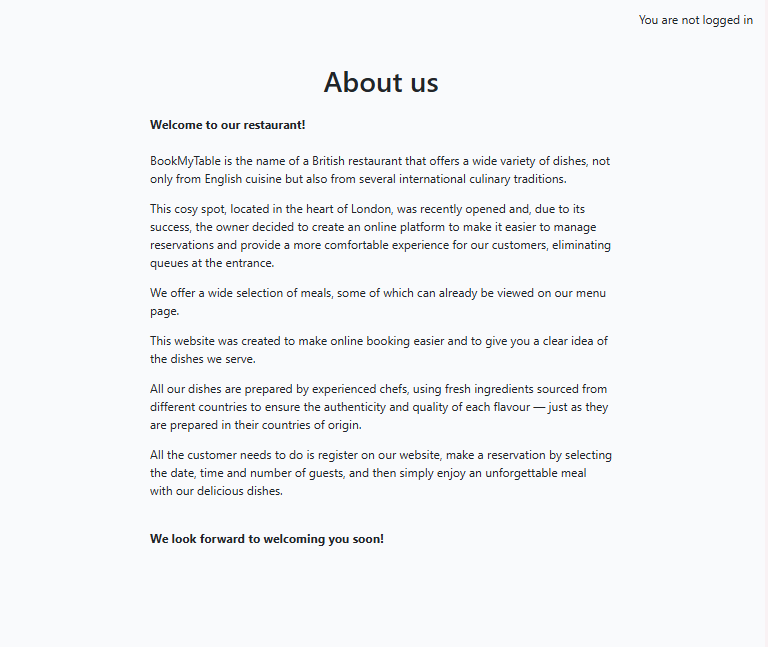
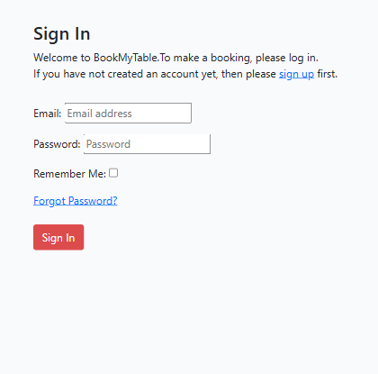
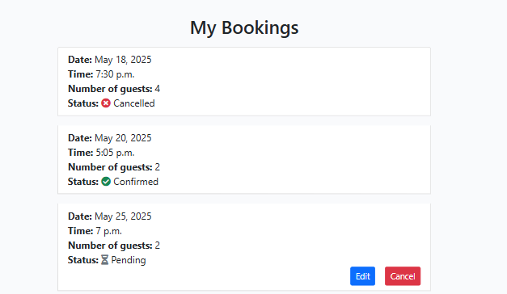
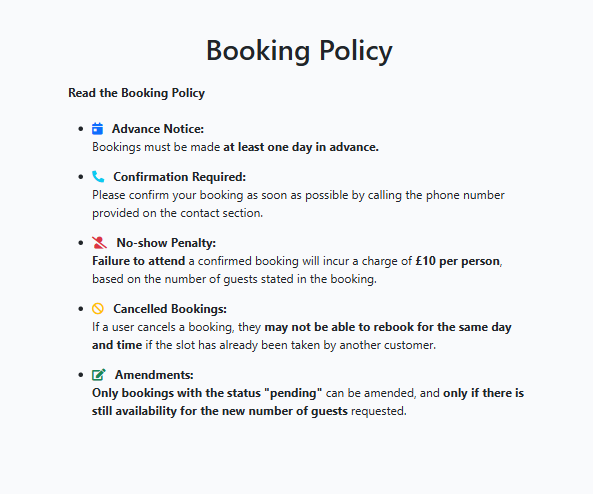

# BookMyTable

BookMyTable is a website that allows customers to make online reservations for a 
specific restaurant, on specific dates and times.
The site owner can manage bookings, view details, prevent double bookings, and keep their menu information up to 
date.
The website also helps customers book a table easily and get a general overview of the dishes available at the restaurant.

## Features

### Existing Features

-_Navigation Bar_

-The navigation bar consists of eight items: five are always visible (Home, Menu, About Us, Register, and Login) and three (Booking, My Bookings, and Logout) are shown only when the user is logged in.

-_Home page_

-The Home page features a welcome message, a hero section with a call-to-action
button, and quick access to the menu, booking, and contact. It also highlights key information about 
the restaurant, such as the team, opening hours, and location.

-_Menu_

-The Menu page displays a selection of dishes served by the restaurant. E ach item includes
An image, name, description, and price, allowing users to get an idea of what they can 
Expect to enjoy during their visit.

-_About Us_

-The About Us page introduces BookMyTable, a recently opened British restaurant located
in London. It explains the concept behind the restaurant and its online platform, highlighting its
mission to simplify bookings and enhance the dining experience. The page also emphasizes the restaurant's
 diverse menu, use of fresh international ingredients, and commitment to quality.

-_Register_

-The Register page allows new users to create an account by filling out a simple registration form.
To register, users must provide a valid email address and create a secure password. Once registered, they
can access the booking page.

-_Login_

-The Login page allows registered users to access their account by entering their email and password.

-_Booking_

-The Booking page contains a form where the user needs to select a date, time, and number of guests to make a booking.

-_My Bookings_

-The My Bookings page allows users to view all their bookings, starting from the current day onward.
For bookings with a 'pending' status, users have the option to edit the number of guests or cancel the
reservation. If no bookings have been made, a message is displayed to inform the user.

-_Logout_

-The Logout page allows users to confirm and complete the sign-out process with a single
click.

-_Booking Policy_

-The Booking Policy page can be accessed by clicking the link in the footer. It provides important information
regarding advance notice, confirmation, cancellations, no-shows, and amendments.

-_The Footer_

-The footer contains contact details such as the phone number, restaurant address, a link to the booking
policy, and links to social media.

### Features Left to Implement

## Testing

### Validator Testing

### Unfixed Bugs

## Deployment

## Credits

### Content

### Media
