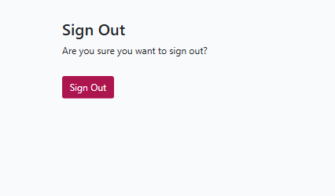
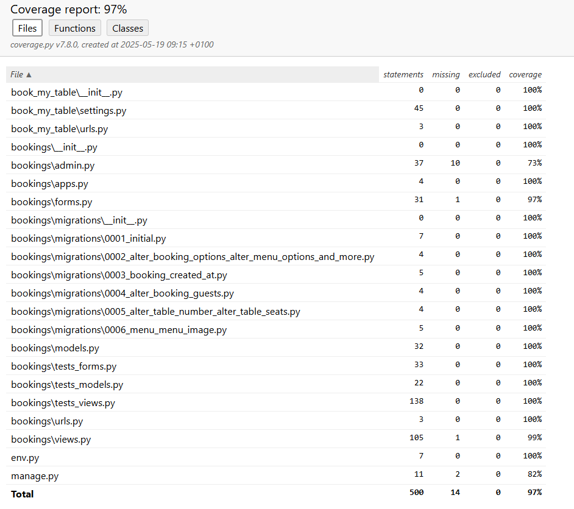

# BookMyTable

BookMyTable is a full-stack web application built with the Django framework. It allows customers to make online reservations for a 
specific restaurant, on specific dates and times.
The site owner can manage bookings, view details, prevent double bookings, and keep their menu information up to 
date.
The website also helps customers book a table easily and get a general overview of the dishes available at the restaurant.

## User Stories & Planning

The user stories for this project were created to reflect the real needs for both the external user and the site owner.
A public GitHub project board was used to organize and prioritize user stories
[Original Project on GitHub](https://github.com/Katia-D15/bookmytable-stories)

## Data Model 

### Models
-Booking - Represents a reservation made by a registered user for a specific date and time.
-Table - Represents a physical table at the restaurant
-Menu - Represents a dish available at the restaurant, including name, description, price and image.

### Relationships
      - One **Booking** can be assigned **one or more Tables**- ManyToMany.
      - Each **Booking** belongs to a single **User**- ForeignKey.
      - **Tables** cannot be double-booked at the same date and time.

## Features

### Existing Features

**_Navigation Bar_**

-The navigation bar consists of eight items: five are always visible (Home, Menu, About Us, Register, and Login) and three (Booking, My Bookings, and Logout) are shown only when the user is logged in.

**_Home page_**

-The Home page features a welcome message, a hero section with a call-to-action
button, and quick access to the menu, booking, and contact. It also highlights key information about 
the restaurant, such as the team, opening hours, and location.

**_Menu_**

-The Menu page displays a selection of dishes served by the restaurant. Each item includes an image, name, description, and price, allowing users to get an idea of what they can expect to enjoy during their visit.

**_About Us_**

-The About Us page introduces BookMyTable, a recently opened British restaurant located
in London. It explains the concept behind the restaurant and its online platform, highlighting its
mission to simplify bookings and enhance the dining experience. The page also emphasizes the restaurant's
 diverse menu, use of fresh international ingredients, and commitment to quality.

**_Register_**

-The Register page allows new users to create an account by filling out a simple registration form.
To register, users must provide a valid email address and create a secure password. Once registered, they
can access the booking page.

**_Login_**

-The Login page allows registered users to access their account by entering their email and password.

**_Booking_**

-The Booking page contains a form where the user needs to select a date, time, and number of guests to make a booking.

**_My Bookings_**

-The My Bookings page allows users to view all their bookings, starting from the current day onward.
For bookings with a 'pending' status, users have the option to edit the number of guests or cancel the
reservation. If no bookings have been made, a message is displayed to inform the user.

**_Logout_**

-The Logout page allows users to confirm and complete the sign-out process with a single
click.

**_Booking Policy_**

-The Booking Policy page can be accessed by clicking the link in the footer. It provides important information
regarding advance notice, confirmation, cancellations, no-shows, and amendments.

**_The Footer_**

-The footer contains contact details such as the phone number, restaurant address, a link to the booking
policy, and links to social media.

### Features Left to Implement

-Add categorized sections to the menu page (Starters, Main Courses, Vegetarian, Desserts, etc.), allowing users to click and view dish options available in each category.

## Testing

### Validator Testing

-HTML
- No errors were returned when passing the official [W3C HTML Validator](https://validator.w3.org/)

-CSS
- No errors were returned when passing the official [W3C CSS Validator](https://jigsaw.w3.org/css-validator/)
        
-Python
- No errors were returned when passing the code through [Code institute CI Python Linter](https://pep8ci.herokuapp.com/#)

-Tools used:
- [unittest] Python's standard library for unit testing.
- [coverage] to measure test coverage.

Below is a screenshot of the HTML coverage report:

**Automated Tests (Python-Django)**
- Form tests (bookings/tests_forms.py)
- View tests (bookings/tests_views.py)
- Model tests  (bookings/tests_models.py)

**Manual Tests (JavaScript)**
- The success and info messages disappear after 3.5 seconds
- Each item in navbar goes to the correct page
- The 'See Menu' button opens the menu page
- The 'Booking' button opens the login page if the user is not logged in
- The 'Booking' button opens the booking page if the user is logged in
- The 'Contact Us' button scrolls to the footer
- Social media icons open the corresponding social pages
- The 'View Map' button opens Google Maps
- The Booking Policy link opens the Booking Policy Page
- The Cancel button shows a confirmation alert before cancelling
- The Edit button shows a confirmation alert before editing
- The Sign Out button logs the user out and redirects to the home page
- Warning messages require the user to click to close them
- Validation of required fields (`date`, `time`, `guests`)
- Validation of minimum number of guests (`guests >= 1`)
- Validation of minimum booking date (at least 1 day in advance)
Validation of booking time within business hours (between 11:00 and 22:00)

### Unfixed Bugs
- bookings/admin.py: 10 lines untested, related to non-critical Django Admin.
- manage.py: 82% coverage; not tested as it's a standard Django entry-point.
- bookings/forms.py: 1 uncovered line linked to a rare, unreproduced exception.
- bookings/views.py: 1 untested line related to a non-critical user error case.

## Deployment

-This project was deployed using **Heroku**, with the source code hosted on **GitHub**.

**Steps for deployment:**
- Fork or clone the repository using the GitHub interface
- Create a new Heroku app
- Set the buildpacks
- Link the Heroku app to the Github repository
- Deploy the application

## Credits

### Content
-  The backend web framework used: [Django](https://www.djangoproject.com/)
- The base template (`base.html`) and some CSS code were taken from the Code Institute's Codestar Project.
- The icons were taken from [Font Awesome](https://fontawesome.com/)
- The project uses [Bootstrap](https://getbootstrap.com/) for responsive layout and styling.

### Media
- The images used on the website were taken from: [Pexels](https://www.pexels.com/)
